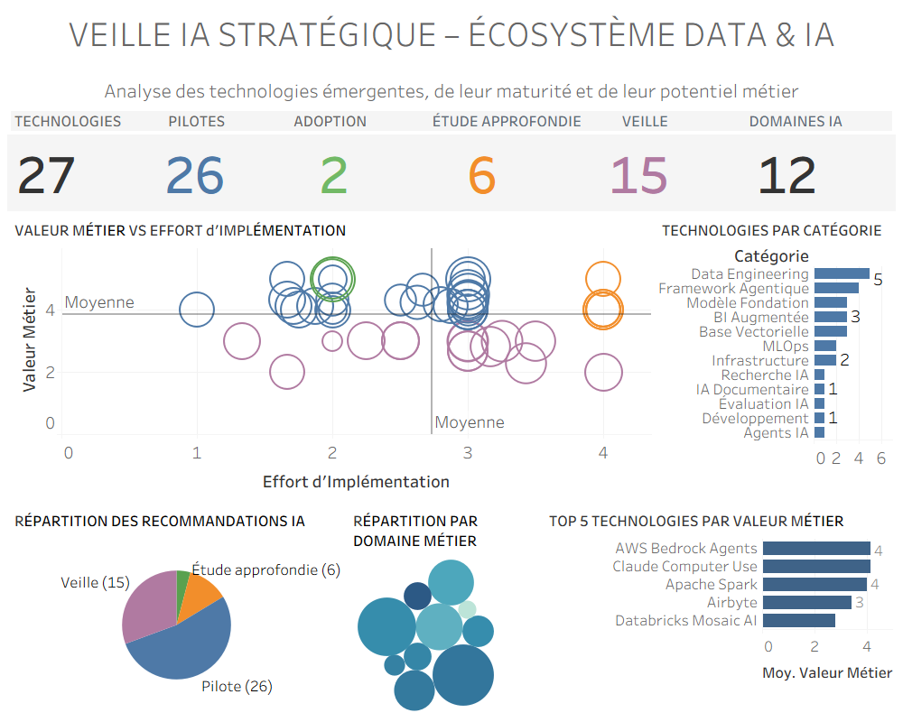

<div align="center">

# 🌌 MinervaRose

### Sabrina Palis Jorgenson

[🇫🇷 Version française](README_FR.md)

### AI Systems • Computational Research • Analytics & Visualization • Technical Education

*MSc Artificial Intelligence — First Class Honours*


I build AI and data systems, teach technical subjects, and explore the questions that emerge when computation meets human judgement.

My work spans **decision-support systems, machine learning, computational research, analytics, technical education, and writing on AI, language, cognition, and science**.

My path into technology began in education and the humanities rather than computer science. That background still shapes how I build: with a strong interest in clarity, evidence, explainability, and technologies that help people understand complex situations rather than obscure them.

**Portfolio:**  
https://minervarose.github.io/

Currently open to selected collaborations, consulting, mentoring, research-oriented projects, and applied AI education opportunities.

</div>

---

# My Journey into AI

My journey into artificial intelligence did not begin in an engineering school or a traditional computer science programme.

On **November 6, 2017**, I received a life-changing email: I had been selected for the **Google Developer Scholarship Challenge** hosted through Udacity.

At the time, I had no professional background in software development. I came from education, languages, and the humanities. What began as curiosity soon became a passion for building technology and solving problems through code.

That first opportunity led to further competitive scholarship programmes, including initiatives supported by **Google** and **Facebook**, followed by sustained study in Android development, deep learning, reinforcement learning, autonomous systems, data science, computer vision, and generative AI.

Years later, that unconventional learning journey culminated in an **MSc in Artificial Intelligence with First Class Honours**.

It also shaped the way I approach technology today: with curiosity, interdisciplinary thinking, continuous learning, and the conviction that AI should help people make sense of complex situations while keeping human judgement firmly in the loop.

---

# About

Today my work sits at the intersection of:

- AI systems
- applied computational research
- data science and analytics
- technical education
- scientific and exploratory computing
- human-centered technology

I enjoy designing systems that combine technical implementation, thoughtful analysis, clear communication, and useful interaction.

Many of my projects take the form of explainable AI applications, scientific prototypes, educational systems, interactive visualizations, modular architectures, and decision-support tools.

A recurring question runs through much of this work:

> **How can we turn complexity into something humans can inspect, understand, and act upon?**

---

# A Broader Map

GitHub naturally shows the technical part of my work. The wider picture also includes education, independent research, writing, literature, music, and a persistent fascination with space and scientific questions.

<div align="center">


</div>

These areas are not separate identities for me. They continually influence one another: education shapes how I design technical explanations, literature and language inform my questions about AI and cognition, and scientific curiosity often provides the terrain for new computational experiments.

---

# Systems Perspective

```text
              Curiosity
                  ↓
       Questions ↔ Systems
          ↙          ↘
     Research       Building
          ↘          ↙
       Understanding
              ↓
       Human Decisions
```

Curiosity is usually where my projects begin.

Whether the domain is education, aerospace, finance, scientific research, or public-interest technology, I enjoy exploring unfamiliar problems, connecting disciplines, and building systems that make information more understandable and actionable.

---

# Current Areas of Practice

## AI Systems

Agentic workflows, decision-support systems, orchestration pipelines, LLM applications, explainable AI, machine learning, computer vision, and human-in-the-loop architectures.

## Computational Research

Scientific exploration, anomaly analysis, signal and time-series analysis, computational experimentation, and research-oriented prototype development.

## Technical Education

AI and data science mentoring, curriculum design, educational technologies, technical writing, and project-based learning.

## Analytics & Visualization

Exploratory analysis, dashboards, KPI design, data storytelling, business intelligence, and decision-support visualization.

---

# Selected Projects

| Project | Focus |
| --- | --- |
| ✈️ **Airline Said No** | Explainable airline passenger-rights assistant |
| 📊 **BeLedgerReady** | Explainable financial anomaly analysis and audit readiness |
| 🚀 **industry-integrated-ai-systems-synthesis** | Integrated AI decision-support architecture for aerospace safety |
| 🔥 **PyroNav** | Wildfire evacuation PWA with hazard-aware routing |
| ☀️ **intibi** | H-alpha solar companion translating solar observations into an interactive system |
| 🐦 **bioacoustic-topology** | Computational research on birdsong manifold dynamics |
| 🧠 **latent-physiological-topology** | Exploratory physiological signal analysis |
| 🤖 **design-of-agentic-workflows** | Governed multi-agent workflow architectures |

I also build smaller prototypes for hackathons, teaching, technical demonstrations, and exploratory research. Some are deliberately compact: enough to test an idea, understand its limitations, and decide whether it deserves to grow.

---

# Research & Writing

Alongside building systems, I write essays and technical material exploring some of the deeper questions raised by artificial intelligence and computation.

My interests include **AI and language, cognition, consciousness, representation, responsible AI, mathematics, physics, and the structural implications of emerging technologies**.

Selected essays:

- [**The Linguistic Creature: Language, AI, and the Survival of Information**](https://medium.com/@sabrina.jorgenson/the-linguistic-creature-language-ai-and-the-survival-of-information-4e8ac16acf4b)
- [**I Asked AI to Rate My Face. It Modeled My Mind Instead**](https://medium.com/@sabrina.jorgenson/i-asked-ai-to-rate-my-face-it-modeled-my-mind-instead-cd9e0546dbc5)
- [**The World Is Not Made Of Things**](https://medium.com/@sabrina.jorgenson/the-world-is-not-made-of-things-a486eb9b84c2)
- [**Spinors at the Intersection of Two Geometries**](https://medium.com/@sabrina.jorgenson/spinors-at-the-intersection-of-two-geometries-1de69fed2305)
- [**Are We Asking the Wrong Question About Consciousness?**](https://medium.com/@sabrina.jorgenson/are-we-asking-the-wrong-question-about-consciousness-1636c2df604e)

**Medium:**  
https://medium.com/@sabrina.jorgenson

Earlier in my creative and educational work, I also created the French literary YouTube channel **Tes grands auteurs en petits morceaux**, now rebranded as **Pale Blue Manifold**, where several of its most successful literary biographies remain as legacy videos.

The medium has changed over the years, but the underlying impulse has remained surprisingly consistent: understand difficult material, find its structure, and make it communicable.

---

# Design Philosophy

Across domains, I prefer systems that are:

- explainable rather than opaque
- evidence-based rather than confidently speculative
- human-centered rather than autonomous by default
- explicit about uncertainty
- modular and reproducible
- technically rigorous while remaining accessible

The technologies evolve quickly. These principles remain much more stable.

---

# Analytics & Visualization

In addition to AI systems and computational research, I develop dashboards and visualization systems designed to support exploration, prioritization, communication, and decision-making.

Recent work includes technology-watch dashboards, exploratory scientific visualizations, and business-oriented analytics built with Tableau and related platforms.

<div align="center">

<a href="https://public.tableau.com/views/veille_ia_strategique/Tableaudebord1?:language=fr-FR&publish=yes&:display_count=n&:origin=viz_share_link">

</a>

</div>

**Interactive Dashboard**

https://public.tableau.com/views/veille_ia_strategique/Tableaudebord1?:language=fr-FR&publish=yes&:display_count=n&:origin=viz_share_link

This project demonstrates the complete workflow behind analytical dashboard development:

- data preparation
- KPI design
- exploratory visualization
- dashboard storytelling
- executive decision support

---

# Teaching & Mentoring

Education remains one of the foundations of my technical work.

Alongside AI and data projects, I mentor learners, design educational resources, and teach technical subjects. I am particularly interested in helping learners move beyond reproducing procedures toward understanding systems, making decisions, and explaining their reasoning.

My teaching approach emphasizes curiosity, practical experimentation, systems thinking, clear communication, and the confidence to investigate when something does not work.

---

# Autonomous Systems Portfolio

One of the most formative stages of my AI journey was completing the **Self-Driving Car Engineer Nanodegree**.

The programme introduced me to systems in which perception, localization, prediction, planning, and control must work together under uncertainty. That systems perspective continues to influence how I approach AI today.

🚗 **Portfolio Hub**

https://github.com/MinervaRose/Self-Driving-Car-Engineer-Nanodegree-Projects

Representative projects include:

- Advanced Lane Finding
- Traffic Sign Classification
- Behavioral Cloning
- Extended Kalman Filter
- Vehicle Localization
- Highway Path Planning
- PID Vehicle Control

---

# Milestones & Foundations

| Milestone | Year |
| --- | ---: |
| Google Developer Scholarship Challenge | 2017 |
| Android Basics Nanodegree | 2018 |
| Facebook AI & PyTorch Scholarship | 2018 |
| Deep Learning Nanodegree | 2019 |
| Facebook AI Deep Reinforcement Learning Scholarship | 2019 |
| Deep Reinforcement Learning Nanodegree | 2019 |
| Further studies across autonomous systems, data science, computer vision, and AI | ... |
| MSc Artificial Intelligence — First Class Honours | 2026 |

Those programmes marked my transition from curiosity-driven learner to AI practitioner, educator, researcher, and builder.

---

# Methods & Tooling

```text
Languages & Development
Python • SQL • Jupyter • Git • GitHub

AI & Machine Learning
Machine Learning • Deep Learning • NLP • LLM Systems
Computer Vision • Agentic Workflows • Human-in-the-Loop AI

Data & Analytics
Tableau • Power BI • Exploratory Analysis
Data Visualization • Decision Support • KPI Design

Research & Exploration
Scientific Computing • Signal Analysis
Anomaly Detection • Computational Research

Education & Communication
Mentoring • Technical Writing
Educational Technology • Curriculum Design
```

---

# Beyond the Stack

I remain deeply attached to the humanities that preceded my technical career: literature, language, essays, and science fiction continue to shape the questions I ask.

I also play piano and have a particular affection for the music of **Joseph Bologne, Chevalier de Saint-Georges**.

And space, unsurprisingly, keeps finding its way back into the things I build.

---

<div align="center">


### ✦ Curiositas ad Lucem ✦

</div>
