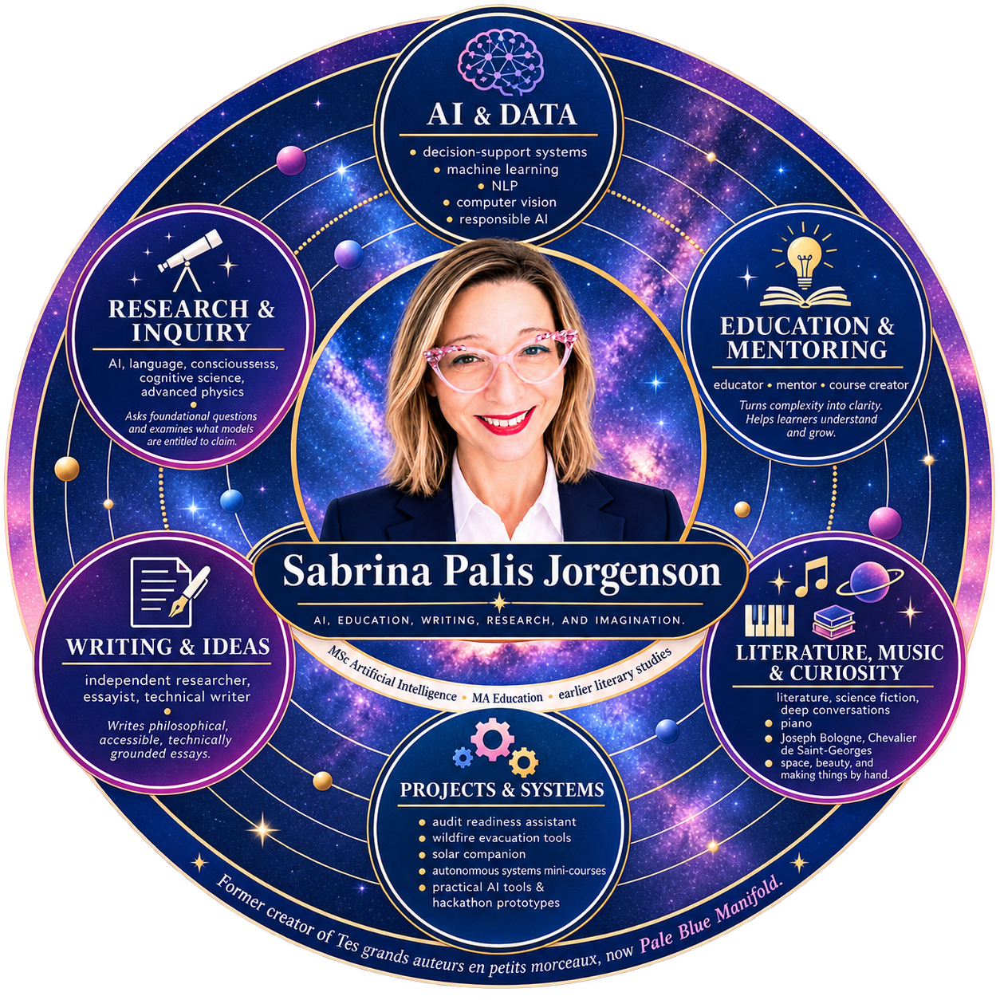

<div align="center">

# 🌌 MinervaRose

### Sabrina Palis Jorgenson

[🇫🇷 Version française](README_FR.md)

### AI & Data Educator • Mentor & Certification Juror • Independent Researcher

**Applied AI Systems • Computational Research • Analytics & Visualization • Technical Education**

*MSc Artificial Intelligence — First Class Honours · MA Education — Merit · PGCE/QTS*


I work at the intersection of **applied AI, computational research, data, and technical education**.

My technical practice has developed continuously since 2017 through structured study and project work across software development, machine learning, deep learning, computer vision, autonomous systems, reinforcement learning, data science, cloud technologies, and generative AI, culminating in an **MSc in Artificial Intelligence with First Class Honours** in 2026.

Today, I build AI and data systems, conduct independent computational research, mentor AI and data learners, design technical learning resources, and assess project-based work.

Across these activities, I am particularly interested in **explainability, evidence, uncertainty, reproducibility, human judgement, and responsible human–AI collaboration**.

[**Portfolio**](https://minervarose.github.io/) · [**ORCID**](https://orcid.org/0009-0009-4663-9778) · [**Medium**](https://medium.com/@sabrina.jorgenson) · [**LinkedIn**](https://www.linkedin.com/in/sabrina-jp/)

</div>

---

## Selected Projects

| Project | Focus |
| --- | --- |
| ✈️ **Airline Said No** | Explainable airline passenger-rights assistant |
| 📊 **BeLedgerReady** | Financial anomaly analysis and audit-readiness assistant |
| 🚀 [**Industry-Integrated AI Systems Synthesis**](https://github.com/MinervaRose/industry-integrated-ai-systems-synthesis) | Auditable AI decision-support architecture for aerospace safety |
| 🔥 **PyroNav** | Wildfire evacuation PWA with hazard-aware routing |
| ☀️ **intibi** | Interactive companion driven by H-alpha solar observations |
| 🐦 **bioacoustic-topology** | Computational exploration of birdsong manifold dynamics |
| 🧠 **latent-physiological-topology** | Exploratory physiological signal analysis |
| 🤖 **design-of-agentic-workflows** | Governed multi-agent workflow architectures |

I also build compact prototypes for **hackathons, teaching, and exploratory research**. These projects are deliberately scoped to test an idea, expose its limitations, and determine whether it deserves further development.

---

## Areas of Practice

### AI Systems

Decision-support systems, LLM applications, agentic workflows, orchestration pipelines, explainable AI, machine learning, computer vision, and human-in-the-loop architectures.

### Computational Research

Scientific exploration, anomaly analysis, signal and time-series analysis, computational experimentation, research-oriented prototypes, and open, reproducible research practices.

### Analytics & Visualization

Exploratory analysis, dashboards, KPI design, data storytelling, business intelligence, and decision-support visualization.

### Technical Education

AI and data mentoring, higher-education technical teaching, curriculum design, educational technology, technical writing, project assessment, and project-based learning.

---

## Technical Foundations

```text
Languages & Development  Python • SQL • Jupyter • Git • GitHub
AI & Machine Learning     ML • Deep Learning • NLP • LLM Systems • Computer Vision
Data & Analytics          Tableau • Power BI • EDA • Data Visualization • KPI Design
Research                  Scientific Computing • Signal Analysis • Anomaly Detection
Systems                   Agentic Workflows • Human-in-the-Loop AI • Decision Support
```

My systems perspective was strongly shaped by autonomous driving, where perception, localization, prediction, planning, and control must work together under uncertainty. My earlier projects in this field are collected in the [Self-Driving Car Engineer portfolio](https://github.com/MinervaRose/Self-Driving-Car-Engineer-Nanodegree-Projects).

---

## Technical Formation

My route into AI has been cumulative rather than sudden.

Beginning with a **Google Developer Scholarship Challenge in 2017**, I pursued sustained technical development through professional programmes, specialist courses, self-directed study, and increasingly complex projects across software development, machine learning, deep learning, reinforcement learning, autonomous systems, computer vision, cloud technologies, data science, and generative AI.

This included learning through ecosystems such as **Udacity, AWS, Coursera, Intel/OpenVINO, specialist AI academies, and other professional technical programmes**, alongside extensive project-based practice.

That progression eventually led to formal postgraduate study and an **MSc in Artificial Intelligence with First Class Honours**.

The purpose of this GitHub is therefore not simply to collect projects. It documents an evolving technical practice: learning, building, testing ideas, investigating questions, and making that work inspectable.

---

## Research & Open Science

My independent research explores how computation can help us inspect complex systems, identify structure, represent uncertainty, and generate questions worth investigating further.

Current interests include scientific triage, signal and time-series analysis, multimodal data, computational representations, anomaly detection, human–AI collaboration, and exploratory scientific visualization.

I am particularly interested in research artefacts that remain **inspectable and reproducible**: repositories, notebooks, datasets, visualizations, documented experiments, and openly shared outputs.

**ORCID:** [0009-0009-4663-9778](https://orcid.org/0009-0009-4663-9778)

---

## Research & Writing

Alongside technical work, I write about AI, language, cognition, representation, mathematics, science, and the structural implications of emerging technologies.

- [**The Linguistic Creature: Language, AI, and the Survival of Information**](https://medium.com/@sabrina.jorgenson/the-linguistic-creature-language-ai-and-the-survival-of-information-4e8ac16acf4b)
- [**I Asked AI to Rate My Face. It Modeled My Mind Instead**](https://medium.com/@sabrina.jorgenson/i-asked-ai-to-rate-my-face-it-modeled-my-mind-instead-cd9e0546dbc5)
- [**The World Is Not Made Of Things**](https://medium.com/@sabrina.jorgenson/the-world-is-not-made-of-things-a486eb9b84c2)
- [**Spinors at the Intersection of Two Geometries**](https://medium.com/@sabrina.jorgenson/spinors-at-the-intersection-of-two-geometries-1de69fed2305)

---

## Teaching, Mentoring & Assessment

Education was my original professional field and remains an integral part of my technical practice.

I currently work with learners in AI, data, analytics, and related technical subjects through **mentoring, teaching, project assessment, curriculum development, and the design of learning resources**.

My approach emphasizes understanding systems rather than reproducing procedures: learners should be able to explain what they built, why they made particular technical choices, what the limitations are, and how evidence supports their conclusions.

My background in education also informs how I design AI systems: interfaces, explanations, uncertainty, human oversight, and the way complex information is communicated are not secondary concerns. They are part of the system itself.

---

## A Cross-Disciplinary Practice

I entered technology from education, languages, and the humanities rather than through a conventional engineering pathway.

Instead of replacing that earlier background, technical study expanded it.

The result is a practice that moves between **AI systems, data, research, education, scientific inquiry, and communication**. That cross-disciplinary perspective shapes both the problems I choose and the way I approach them.

I am particularly drawn to work where computation is not merely used to automate a task, but to help people **see structure, examine evidence, explore uncertainty, learn, or make more informed decisions**.

---

## Beyond the Code

Literature, language, music, and a persistent fascination with space influence the questions I explore, even when the result is a technical system.

<div align="center">



<br>


### ✦ Curiositas ad Lucem ✦

</div>
