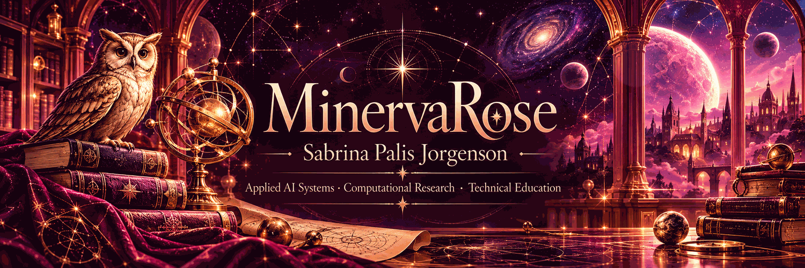
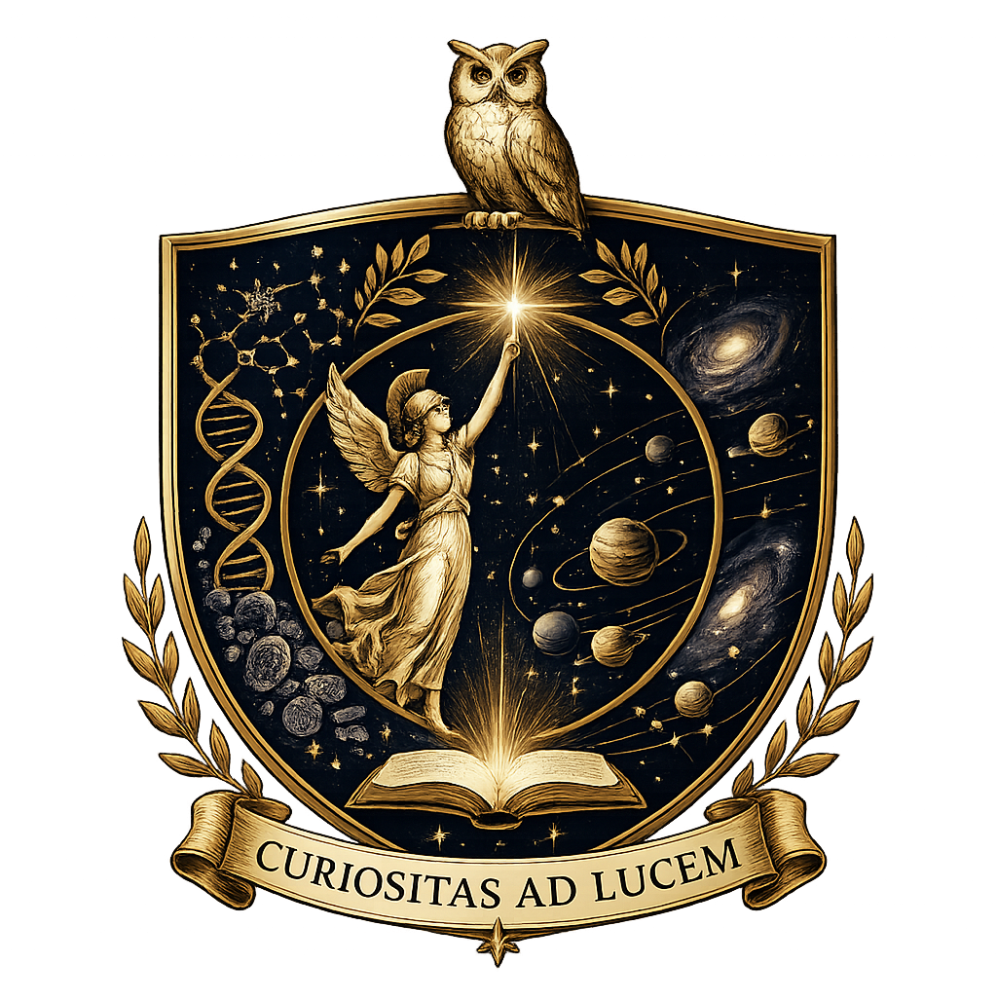

<div align="center">



[🇫🇷 Version française](README_FR.md)

<br>

[**Portfolio**](https://minervarose.github.io/) · [**ORCID**](https://orcid.org/0009-0009-4663-9778) · [**Medium**](https://medium.com/@sabrina.jorgenson) · [**LinkedIn**](https://www.linkedin.com/in/sabrina-jp/)

<br>


</div>

---

I build and evaluate **AI and data systems for complex decisions, computational research, and technical learning**.

My work sits at the intersection of **applied AI, data, scientific computing, and education**, with particular attention to **evidence, uncertainty, auditability, reproducibility, explainability, and human judgement**.

My technical practice has developed continuously since 2017 through scholarship-supported programmes, nanodegrees, specialist study, project work, and postgraduate education, culminating in an **MSc in Artificial Intelligence with First Class Honours**.

---

## ✦ Featured Work

| Project | Focus |
| --- | --- |
| 🚀 [**Industry-Integrated AI Systems Synthesis**](https://github.com/MinervaRose/industry-integrated-ai-systems-synthesis) | Auditable AI decision-support architecture for aerospace safety |
| 📊 **BeLedgerReady** | Financial anomaly analysis and audit-readiness decision support |
| 🐦 **bioacoustic-topology** | Computational exploration of structure and dynamics in birdsong |
| 🔥 **PyroNav** | Wildfire evacuation PWA with hazard-aware routing |
| 🪐 **Exoplanet Discovery Observatory** | Scientific data exploration and visualisation using exoplanet data |
| 🧩 **Clues** | Evidence-oriented debugging and reasoning tools for technical learning |

These projects reflect the areas I care about most: **building systems that remain inspectable, making evidence visible, and using computation to support rather than replace judgement**.

---

## ✦ Areas of Practice

### Applied AI Systems
Decision-support systems, LLM applications, agentic workflows, machine learning, computer vision, explainable AI, orchestration pipelines, and human-in-the-loop architectures.

### Computational Research
Scientific exploration, anomaly analysis, signal and time-series analysis, computational experimentation, scientific visualisation, and research-oriented prototypes.

### Analytics & Visualisation
Exploratory analysis, dashboards, KPI design, data storytelling, business intelligence, and visual decision support.

### Technical Education
Higher-education technical teaching, AI and data mentoring, curriculum design, project assessment, educational technology, technical writing, and project-based learning.

---

## ✦ Research & Open Science

I am particularly interested in research artefacts that remain **inspectable, reproducible, and attributable**: repositories, notebooks, datasets, visualisations, documented experiments, technical reports, and versioned releases.

Selected research and capstone work is published with clear provenance, including **Zenodo and DOI records where appropriate**.

**ORCID:** [0009-0009-4663-9778](https://orcid.org/0009-0009-4663-9778)

Current and emerging interests include:

**scientific triage · signal and time-series analysis · multimodal data · anomaly detection · human–AI collaboration · scientific visualisation · decision support under uncertainty**

---

## ✦ Technical Foundations

```text
Languages & Development  Python • SQL • Jupyter • Git • GitHub
AI & Machine Learning     ML • Deep Learning • NLP • LLM Systems • Computer Vision
Data & Analytics          Tableau • Power BI • EDA • Data Visualization • KPI Design
Research                  Scientific Computing • Signal Analysis • Anomaly Detection
Systems                   Agentic Workflows • Human-in-the-Loop AI • Decision Support
```

My systems perspective was strongly shaped by autonomous driving, where perception, localisation, prediction, planning, and control must work together under uncertainty.

Earlier work in this field is collected in the [Self-Driving Car Engineer portfolio](https://github.com/MinervaRose/Self-Driving-Car-Engineer-Nanodegree-Projects).

---

## ✦ Technical Formation

My route into AI has been **cumulative rather than sudden**.

Beginning with the **Google Developer Scholarship Challenge in 2017**, I pursued sustained technical development through project-based programmes, scholarships, nanodegrees, specialist courses, and self-directed study across software development, machine learning, deep learning, reinforcement learning, autonomous systems, computer vision, data science, cloud technologies, and generative AI.

That progression eventually led to formal postgraduate study and an **MSc in Artificial Intelligence with First Class Honours**.

<details>
<summary><strong>Selected technical programmes, nanodegrees & scholarships</strong></summary>

<br>

- Google Developer Scholarship Challenge
- Facebook AI Scholarship
- Bertelsmann Data Science Scholarship
- Self-Driving Car Engineer Nanodegree
- Deep Learning studies and project work
- Generative AI Nanodegree
- AWS technical training and cloud foundations
- Computer vision, reinforcement learning, autonomous systems, data science, and applied AI programmes
- Continued specialist study in analytics, scientific computing, Spark/Databricks, and modern AI tooling

</details>

This GitHub documents that progression through **projects, notebooks, experiments, systems, and research artefacts**, rather than treating credentials as an endpoint in themselves.

---

## ✦ Teaching, Mentoring & Assessment

Education was my original professional field and remains an integral part of my technical practice.

I work across **higher-education technical teaching, AI and data mentoring, curriculum development, project assessment, and professional certification**. I support learners working in data analysis, business intelligence, data engineering, data science, machine learning, Python, SQL, model evaluation, and generative AI.

I also serve as a **Generative AI Certification Juror & Evaluator**, assessing practical work, technical reasoning, methodology, documentation, communication, and responsible AI practice.

My approach is demanding but learner-centred: the goal is not simply to complete a task, but to understand **what was built, why particular choices were made, what the limitations are, and what the evidence actually supports**.

---

## ✦ Research & Writing

Alongside technical work, I write about AI, language, cognition, representation, mathematics, science, and the structural implications of emerging technologies.

- [**The Linguistic Creature: Language, AI, and the Survival of Information**](https://medium.com/@sabrina.jorgenson/the-linguistic-creature-language-ai-and-the-survival-of-information-4e8ac16acf4b)
- [**I Asked AI to Rate My Face. It Modeled My Mind Instead**](https://medium.com/@sabrina.jorgenson/i-asked-ai-to-rate-my-face-it-modeled-my-mind-instead-cd9e0546dbc5)
- [**The World Is Not Made Of Things**](https://medium.com/@sabrina.jorgenson/the-world-is-not-made-of-things-a486eb9b84c2)
- [**Spinors at the Intersection of Two Geometries**](https://medium.com/@sabrina.jorgenson/spinors-at-the-intersection-of-two-geometries-1de69fed2305)

---

## ✦ GitHub Activity

<div align="center">


</div>

---

## ✦ Beyond the Code

I entered technology through **education, languages, and the humanities rather than a conventional engineering pathway**. Technical study expanded that earlier background rather than replacing it.

The result is a practice that moves between **AI systems, data, research, education, scientific inquiry, and communication**.

Literature, language, music, and a persistent fascination with space continue to influence the questions I explore, even when the result takes the form of a technical system.

<div align="center">



### ✦ Curiositas ad Lucem ✦

</div>
