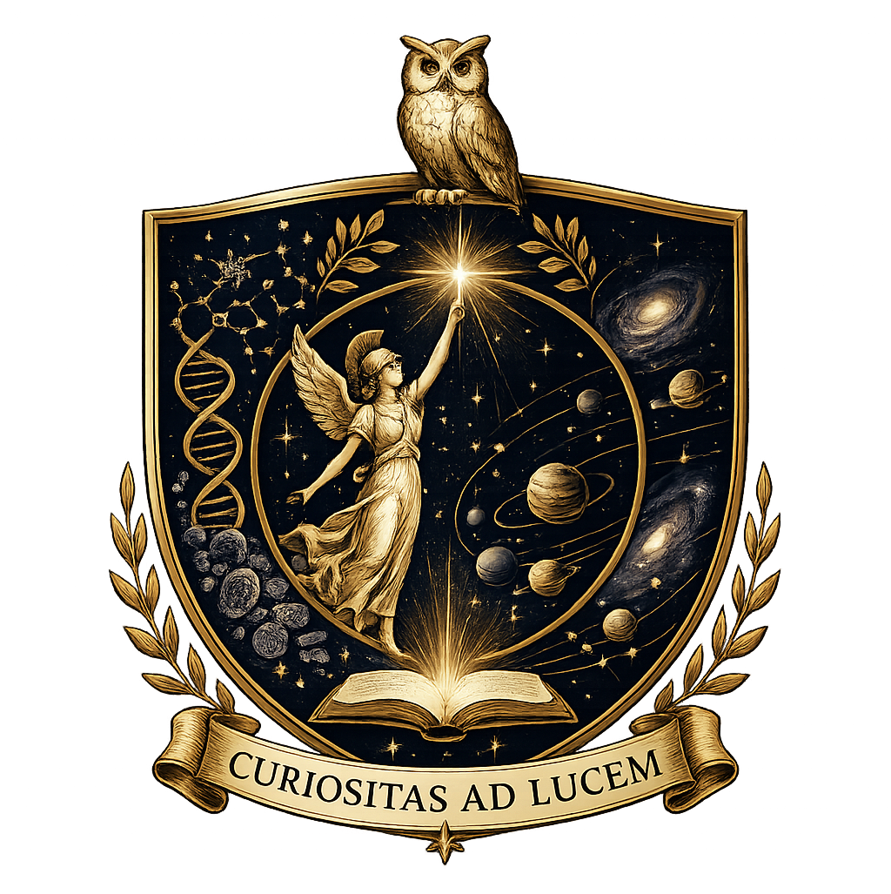
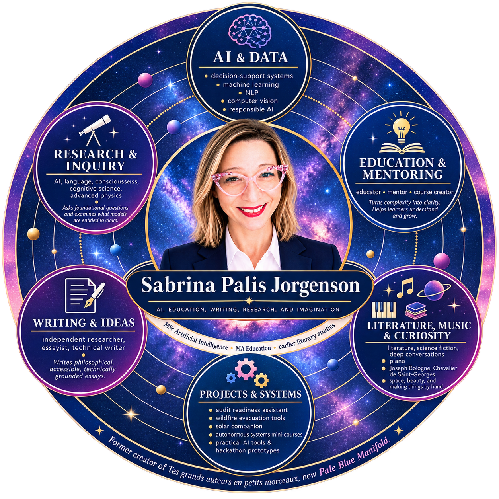

<div align="center">

# 🌌 MinervaRose

### Sabrina Palis Jorgenson

[🇬🇧 English version](README.md)

### Systèmes d'IA • Recherche computationnelle • Analyse & Visualisation • Formation technique

*MSc Artificial Intelligence — First Class Honours*




Je conçois des systèmes d'IA et de données qui aident à examiner des informations complexes, à comprendre l'incertitude et à prendre de meilleures décisions.

Mon travail associe **systèmes d'aide à la décision, machine learning, recherche computationnelle, analyse, visualisation et formation technique**, avec un intérêt particulier pour l'explicabilité et le jugement humain.

[**Portfolio**](https://minervarose.github.io/fr/) · [**Medium**](https://medium.com/@sabrina.jorgenson) · [**LinkedIn**](https://www.linkedin.com/in/sabrina-jp/)

</div>

---

## Projets sélectionnés

| Projet | Domaine |
| --- | --- |
| ✈️ **Airline Said No** | Assistant explicable sur les droits des passagers aériens |
| 📊 **BeLedgerReady** | Analyse d'anomalies financières et préparation à l'audit |
| 🚀 [**Industry-Integrated AI Systems Synthesis**](https://github.com/MinervaRose/industry-integrated-ai-systems-synthesis) | Architecture auditable d'aide à la décision pour la sécurité aérospatiale |
| 🔥 **PyroNav** | PWA d'évacuation face aux incendies avec routage tenant compte des dangers |
| ☀️ **intibi** | Compagnon interactif alimenté par des observations solaires en H-alpha |
| 🐦 **bioacoustic-topology** | Exploration computationnelle de la dynamique des chants d'oiseaux |
| 🧠 **latent-physiological-topology** | Analyse exploratoire de signaux physiologiques |
| 🤖 **design-of-agentic-workflows** | Architectures gouvernées de workflows multi-agents |

Je développe également des prototypes ciblés pour des hackathons, l'enseignement et la recherche exploratoire. Leur périmètre est volontairement limité afin de tester une idée, d'en révéler les limites et de déterminer si elle mérite d'être approfondie.

---

## Domaines d'activité

### Systèmes d'IA

Systèmes d'aide à la décision, applications LLM, workflows agentiques, pipelines d'orchestration, IA explicable, machine learning, vision par ordinateur et architectures avec supervision humaine.

### Recherche computationnelle

Exploration scientifique, analyse d'anomalies, traitement de signaux et de séries temporelles, expérimentation computationnelle et prototypes orientés recherche.

### Analyse & Visualisation

Analyse exploratoire, tableaux de bord, conception de KPI, data storytelling, business intelligence et visualisation pour l'aide à la décision.

### Formation technique

Mentorat en IA et data, ingénierie pédagogique, technologies éducatives, rédaction technique et apprentissage par projets.

---

## Fondations techniques

```text
Langages & développement  Python • SQL • Jupyter • Git • GitHub
IA & Machine Learning     ML • Deep Learning • NLP • Systèmes LLM • Vision par ordinateur
Data & Analyse            Tableau • Power BI • EDA • Visualisation • Conception de KPI
Recherche                 Calcul scientifique • Analyse de signaux • Détection d'anomalies
Systèmes                  Workflows agentiques • Supervision humaine • Aide à la décision
```

Ma vision des systèmes a été profondément façonnée par la conduite autonome, où perception, localisation, prédiction, planification et contrôle doivent fonctionner ensemble dans l'incertitude. Mes premiers projets dans ce domaine sont réunis dans mon [portfolio Self-Driving Car Engineer](https://github.com/MinervaRose/Self-Driving-Car-Engineer-Nanodegree-Projects).

---

## Recherche & Écriture

En parallèle de mon travail technique, j'écris sur l'IA, le langage, la cognition, la représentation, la science et les implications structurelles des technologies émergentes.

- [**The Linguistic Creature: Language, AI, and the Survival of Information**](https://medium.com/@sabrina.jorgenson/the-linguistic-creature-language-ai-and-the-survival-of-information-4e8ac16acf4b)
- [**I Asked AI to Rate My Face. It Modeled My Mind Instead**](https://medium.com/@sabrina.jorgenson/i-asked-ai-to-rate-my-face-it-modeled-my-mind-instead-cd9e0546dbc5)
- [**The World Is Not Made Of Things**](https://medium.com/@sabrina.jorgenson/the-world-is-not-made-of-things-a486eb9b84c2)
- [**Spinors at the Intersection of Two Geometries**](https://medium.com/@sabrina.jorgenson/spinors-at-the-intersection-of-two-geometries-1de69fed2305)

---

## Enseignement & Mentorat

L'éducation a été ma voie d'entrée dans la technologie et reste une composante de ma pratique technique. J'accompagne des apprenants, j'enseigne l'IA et la data, et je conçois des ressources qui les aident à dépasser la simple reproduction de procédures pour comprendre les systèmes, prendre des décisions et expliquer leur raisonnement.

---

## Un parcours atypique

J'ai rejoint la technologie par l'éducation, les langues et les humanités. Le Google Developer Scholarship Challenge de 2017 m'a conduite à étudier durablement le développement logiciel, le deep learning, l'apprentissage par renforcement, les systèmes autonomes, la data science, la vision par ordinateur et l'IA générative, jusqu'à l'obtention en 2026 d'un **MSc en intelligence artificielle avec First Class Honours**.

Ce parcours continue de façonner ma manière de concevoir : avec une attention particulière portée aux preuves, à la clarté, à l'explicabilité, à l'incertitude et aux personnes qui utiliseront réellement le système.

---

## Au-delà du code

La littérature, le langage, la musique et une fascination persistante pour l'espace influencent les questions que j'explore, même lorsque le résultat prend la forme d'un système technique.

<div align="center">



<br>


### ✦ Curiositas ad Lucem ✦

</div>
